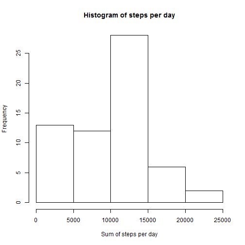
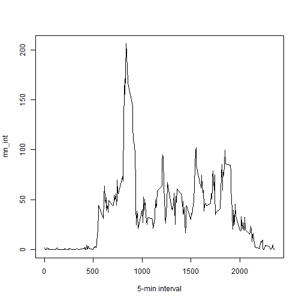
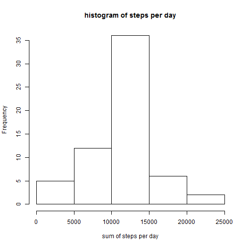
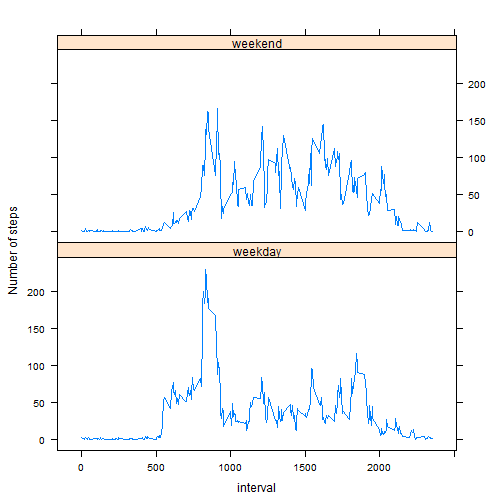

# Reproducible Research: Peer Assessment 1
==============================================================

## Preparing the R environment

### Set options

```r
library(knitr)
opts_chunk$set(echo = TRUE, results = 'hold')
```
## Loading and preprocessing the data

1. Load the data (i.e. > <font color='red'>read.csv()</font>)  
2. Process/transform the data (if necessary) into a format suitable for your analysis


```r
activity <- read.csv("activity.csv", header = T, sep = ",")
df_summary <- NULL
```

## What is mean total number of steps taken per day?
1. Calculate the total number of steps taken per day


```r
sum_steps <- tapply(activity$steps, activity$date, sum, na.rm=T)
head(sum_steps)
```

```
## 2012-10-01 2012-10-02 2012-10-03 2012-10-04 2012-10-05 2012-10-06 
##          0        126      11352      12116      13294      15420
```

2. Make a histogram of the total number of steps taken each day


```r
hist(sum_steps, xlab = "Sum of steps per day", main = "Histogram of steps per day")
```

 

3. Calculate and report the mean and median of the total number of steps taken per day


```r
mean_sum_steps <- round(mean(sum_steps))
median_sum_steps <- round(median(sum_steps))

print(c("The mean is", mean_sum_steps))
print(c("The mean is", median_sum_steps))
```

```
## [1] "The mean is" "9354"       
## [1] "The mean is" "10395"
```

The mean is **9354** and median is **10395**.

## What is the average daily activity pattern?


1. We make the plot with the time series of the average number of steps taken (averaged across all days) versus the 5-minute intervals:


```r
mn_int <- tapply(activity$steps, activity$interval, mean, na.rm=T)
plot(mn_int ~ unique(activity$interval), type="l", xlab = "5-min interval")
```

 

2. The 5-minute interval (on average across all the days in the dataset) that contains the maximum number of steps is the following (below are shown the interval showing the max. number of steps and the value of the max. number of steps):


```r
mn_int[which.max(mn_int)]
```

```
##      835 
## 206.1698
```

## Imputing missing values:

### 1. Total number of missing values:

The total number of missing values in steps can be calculated using `is.na()` method to check whether the value is mising or not and then summing the logical vector.


```r
tot_na <- table(is.na(activity) == TRUE)
```


```r
summary(activity)
```

```
##      steps                date          interval     
##  Min.   :  0.00   2012-10-01:  288   Min.   :   0.0  
##  1st Qu.:  0.00   2012-10-02:  288   1st Qu.: 588.8  
##  Median :  0.00   2012-10-03:  288   Median :1177.5  
##  Mean   : 37.38   2012-10-04:  288   Mean   :1177.5  
##  3rd Qu.: 12.00   2012-10-05:  288   3rd Qu.:1766.2  
##  Max.   :806.00   2012-10-06:  288   Max.   :2355.0  
##  NA's   :2304     (Other)   :15840
```
All of the NA's are in the steps variable. There are 2304 NA's.

### 2. Strategy for filling in all of the missing values in the dataset

To populate missing values, we choose to replace them with the mean value at the same interval across days. In most of the cases the median is a better centrality measure than mean, but in our case the total median is not much far away from total mean, and probably we can make the mean and median meets.

The 'mn_int' contains the mean for each single interval calculated over the 61 days. The right value coming from 'mn_int' is going to be used to replace the NA at the same interval.


```r
activity2 <- activity  # creation of the dataset that will have no more NAs
for (i in 1:nrow(activity)){
    if(is.na(activity$steps[i])){
        activity2$steps[i]<- mn_int[[as.character(activity[i, "interval"])]]
    }
}
```

### 3. A histogram of the total number of steps taken each day

Now let us plot a histogram of the daily total number of steps taken. The mean and median total number of steps taken per day are reported.


```r
sum_steps2 <- tapply(activity2$steps, activity2$date, sum, na.rm=T)
hist(sum_steps2, xlab = "sum of steps per day", main = "histogram of steps per day")
```

 

### Calculate and report the **mean** and **median** total number of steps taken per day.


```r
mean_sum_steps2 <- round(mean(sum_steps2))
median_sum_steps2 <- round(median(sum_steps2))
```

The mean is **10766** and median is **10766**.

### Do these values differ from the estimates from the first part of the assignment?

In order to compare the new values with the "old" values:


```r
df_summary <- rbind(df_summary, data.frame(mean = c(mean_sum_steps, 
            mean_sum_steps2), median = c(median_sum_steps, median_sum_steps2)))
rownames(df_summary) <- c("with NA's", "without NA's")
print(df_summary)
```

```
##               mean median
## with NA's     9354  10395
## without NA's 10766  10766
```
- **Before filling the data**
    1. Mean  : **9354**
    2. Median: **10395**
    
    
- **After filling the data**
    1. Mean  : **10766**
    2. Median: **10766**
    
We see that the values after filling the data mean and median are equal.

### What is the impact of imputing missing data on the estimates of the total daily number of steps?

For comparison with NA's and without (see earlier):

```r
summary(activity2)
```

```
##      steps                date          interval     
##  Min.   :  0.00   2012-10-01:  288   Min.   :   0.0  
##  1st Qu.:  0.00   2012-10-02:  288   1st Qu.: 588.8  
##  Median :  0.00   2012-10-03:  288   Median :1177.5  
##  Mean   : 37.38   2012-10-04:  288   Mean   :1177.5  
##  3rd Qu.: 27.00   2012-10-05:  288   3rd Qu.:1766.2  
##  Max.   :806.00   2012-10-06:  288   Max.   :2355.0  
##                   (Other)   :15840
```


## Are there differences in activity patterns between weekdays and weekends?

A new column is added to the dataframe, this column will contain the factor "weekday days"" or "weekend days".


```r
activity2$weekday <- c("weekday")
activity2[weekdays(as.Date(activity2[, 2])) %in% c("Saturday", "Sunday", 
        "samedi", "dimanche", "saturday", "sunday", "Samedi", 
        "Dimanche"), ][4] <- c("weekend")
table(activity2$weekday == "weekend")

activity2$weekday <- factor(activity2$weekday)
```

```
## 
## FALSE  TRUE 
## 12960  4608
```

In order to visualize the difference bewteen weekends and days of the week, a new dataframe is created to be usable by the lattice package. First, the data are calculated:


```r
activity2_weekend <- subset(activity2, activity2$weekday == "weekend")
activity2_weekday <- subset(activity2, activity2$weekday == "weekday")

mean_activity2_weekday <- tapply(activity2_weekday$steps, 
            activity2_weekday$interval, mean)
mean_activity2_weekend <- tapply(activity2_weekend$steps, 
            activity2_weekend$interval, mean)
```

Then the dataframe is prepared and the plot is created!


```r
library(lattice)
df_weekday <- NULL
df_weekend <- NULL
df_final <- NULL
df_weekday <- data.frame(interval = unique(activity2_weekday$interval), 
        avg = as.numeric(mean_activity2_weekday), day = rep("weekday", 
        length(mean_activity2_weekday)))

df_weekend <- data.frame(interval = unique(activity2_weekend$interval), 
        avg = as.numeric(mean_activity2_weekend), day = rep("weekend", 
        length(mean_activity2_weekend)))
df_final <- rbind(df_weekday, df_weekend)

xyplot(avg ~ interval | day, data = df_final, layout = c(1, 2), 
       type = "l", ylab = "Number of steps")
```

 

We can see at the graph above that activity on the weekday has the greatest peak from all steps intervals. But, we also can see that weekends activities has more peaks over a hundred than weekday. In the other hand, at weekend we can see better distribution of effort along the time.
